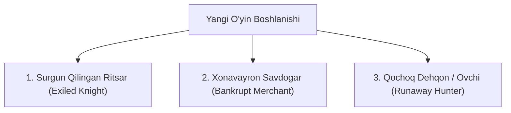
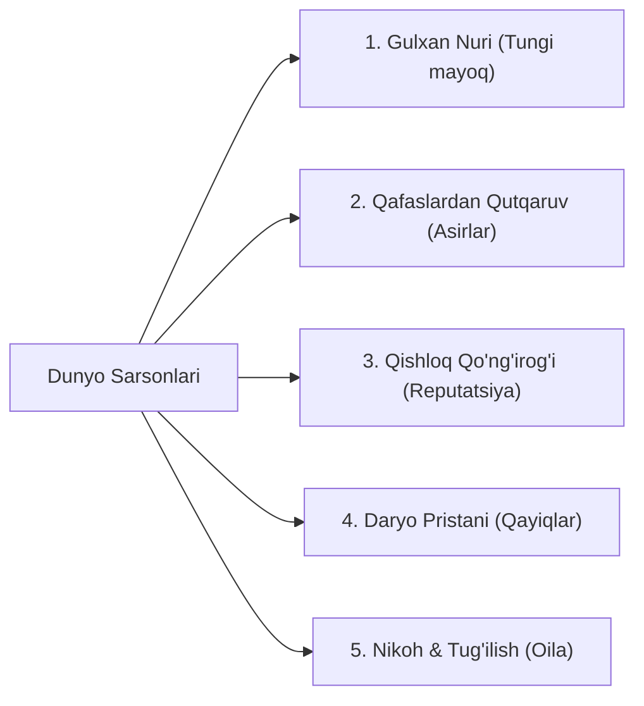
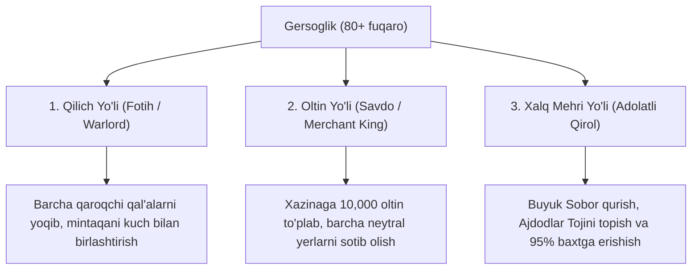

# MASTER GAME DESIGN DOCUMENT (GDD)
# "Voxel Lord: Feudal Realm" 👑

> **Hujjat Maqomi:** To'liq Texnik Loyiha (Specification 1.0)  
> **Janr:** Birinchi Shaxs / Voxel Sandbox / O'rta Asrlar Koloniya Simulyatori (Colony Sim & Strategy)  
> **Dvigatel:** Godot Engine 4.3+ (Forward+ / GDScript & C#)  
> **Platforma:** PC (Steam / Windows, Linux)  
> **Biznes Model:** Pullik Indie Reliz ($14.99 – $19.99), Early Access  

---

## MUNDARIJA
1. [O'yin Konsepsiyasi va Asosiy Falsafasi](#1-oyin-konsepsiyasi-va-asosiy-falsafasi)
2. [O'yinchi Boshlanishi va O'tmish Arxetiplari (Origins)](#2-oyinchi-boshlanishi-va-otmish-arxetiplari-origins)
3. [Aholining Real Paydo Bo'lishi (Demographics & Emergence)](#3-aholining-real-paydo-bolishi-demographics--emergence)
4. [Feodal Mansab Zinapoyasi va Qirollikka 3 Xil Yo'l](#4-feodal-mansab-zinapoyasi-va-qirollikka-3-xil-yol)
5. [4 Ta Feodal Rivojlanish Bosqichi (Tech Tree Tiers 1–4)](#5-4-ta-feodal-rivojlanish-bosqichi-tech-tree-tiers-14)
6. [Biomlar Tizimi va Tundra Issiqxonalari](#6-biomlar-tizimi-va-tundra-issiqxonalari)
7. [Yer Chuqurligi Qatlamlari va Shaxta Mexanikasi](#7-yer-chuqurligi-qatlamlari-va-shaxta-mexanikasi)
8. [20+ Geologik Rudalar, Minerallar va Metallurgiya](#8-20-geologik-rudalar-minerallar-va-metallurgiya)
9. [Mahluqlar Tizimi, Oddiy Dushmanlar va 5 Ta Ulug'vor Boss](#9-mahluqlar-tizimi-oddiy-dushmanlar-va-5-ta-ulugvor-boss)
10. [Boshqaruv Daftari (The Royal Ledger) va Zanjirli Iqtisodiyot](#10-boshqaruv-daftari-the-royal-ledger-va-zanjirli-iqtisodiyot)
11. [Blueprint Qurilish Tizimi va Qal'a Mudofaasi](#11-blueprint-qurilish-tizimi-va-qala-mudofaasi)
12. [Godot 4 Texnik Arxitekturasi va Dasturiy Modullar](#12-godot-4-texnik-arxitekturasi-va-dasturiy-modullar)

---

## 1. O'YIN KONSEPSIYASI VA ASOSIY FALSAFASI

### 1.1. Asosiy Vizyon
*Voxel Lord: Feudal Realm* — bu o'yinchini tayyor taxtga o'tqazib qo'ymaydigan, balki uni oddiy sarson qochqindan tortib, butun mintaqa tan oladigan Buyuk Qirol darajasigacha o'z mehnati bilan ko'tarilishga majbur qiluvchi chuqur birinchi shaxs koloniya simulyatoridir.

### 1.2. 4 Ta Asosiy Ustun (Core Pillars)
1. **Hukmdor Nigohi (First-Person Monarch):** O'yinchi osmondan qarab buyruq beruvchi shaxs emas. U o'z fuqarolarining ko'ziga qaraydi, ular bilan yelkama-yelka mehnat qiladi va shohlik kitobidan butun davlatni boshqaradi.
2. **Mantiqiy Aholi va Zanjir (Living Citizens & Logistics):** Aholi sehrli tarzda paydo bo'lmaydi. Ularning har biri qutqarilgan yoki boshpana izlab kelgan tirik inson. Oziq-ovqat, kiyim, asbob va uysiz ish to'xtaydi.
3. **Voxel Erkinligi + Rejalar (Voxel Freedom & Blueprints):** Har bir blokni qo'lda qo'yish mumkin, yoki katta devor va saroylarni Blueprint orqali chizib, quruvchi fuqarolarga qurdirtirish mumkin.
4. **Feodalizm va Shon-shuhrat (Prestige & Feudal Ladder):** 0-darajali sargardondan Oqsoqol, Baron, Gersog va Tojdor Qirol darajasiga bosqichma-bosqich yuksalish.

---

## 2. O'YINCHI BOSHLANISHI VA O'TMISH ARXETIPLARI (ORIGINS)

O'yin boshida o'yinchi o'zining kelib chiqishi va o'tmishini tanlaydi:



| Arxetip | Boshlang'ich Holat | Afzalligi | Kamchiligi |
| :--- | :--- | :--- | :--- |
| **Surgun Ritsar** | Qilich, eski zanjir sovut, qalqon | Dastlabki yirtqich va qaroqchilardan qo'rqmaydi, jangovar mahorati yuqori | Dehqonchilik va qurilishdan bexabar, asboblar yasashni bilmaydi |
| **Xonavayron Savdogar**| 25 ta kumush tanga, bo'sh aravacha, xarita | Sayyor karvonlar bilan savdo qilishda 25% chegirma, resurslarni tez baholaydi | Jang qilishni bilmaydi, joni kam, qurol ko'tara olmaydi |
| **Qochoq Ovchi** | Kamon, 20 ta o'q, bolta, tuzoqlar | O'rmonda omon qolish, ovchilik va o'tin kesishda 2 barobar tez | Hech qanday sarmoyasi yo'q, xalqaro diplomatiyaga qobiliyatsiz |

---

## 3. AHOLINING REAL PAYDO BO'LISHI (DEMOGRAPHICS & EMERGENCE)

Dunyo bo'sh emas — qulagan eski saltanatning yuzlab och va uysiz odamlari o'rmonlarda sarson yuribdi. Aholi faqatgina quyidagi **5 ta mantiqiy manba** orqali sizga qo'shiladi:



1. **Gulxan Nuri va Oziq-ovqat Tutuni (The Signal Fire):**
   * Tepalikda yoqilgan gulxanning tutuni adashgan sarsonlarga mayoq bo'ladi.
   * Har 2–3 kunda 1 ta och qochqin keladi: *"Menga boshpana va bir burda non bersangiz, sizga xizmat qilaman."*
2. **Qaroqchilar Qafasidan Ozod Qilish (Captive Rescue):**
   * Qaroqchilar qarorgohidagi yog'och qafaslarni buzib ochsangiz, ichidagi professional asirlar (temirchi, duradgor) minnatdor bo'lib fuqaro bo'ladi.
3. **Qishloq Qo'ng'irog'i va Shon-shuhrat (The Village Bell):**
   * Bronzadan qo'ng'iroq quyib chalinganda uning ovozi vodiylarga tarqaladi. Shahar boyligi va non ko'pligi ovoza bo'lib, butun oilalar ko'chib keladi.
4. **Daryo Pristani va Savdo Karvonlari (River Docks):**
   * Daryo bo'yidagi yog'och ko'prikchada har haftada yangi ish qidirgan hunarmandlar to'xtaydi (shartnoma asosida yollanadi).
5. **Oila Qurish va Tabiiy O'sish (Generations):**
   * 2–4 kishilik issiq uylar qurilsa va oziq-ovqat yetarli bo'lsa, fuqarolar oila quradi, chaqaloqlar tug'iladi va voyaga yetib yangi ishchilarga aylanadi.

---

## 4. FEODAL MANSAB ZINAPOYASI VA QIROLLIKKA 3 XIL YO'L

### 4.1. Unvonlar Zinapoyasi
* **0-daraja: Sargardon (Wanderer)** — 1 kishi. Omon qoluvchi.
* **1-daraja: Oqsoqol (Camp Elder)** — 3–8 kishi. Birinchi qo'nalg'a.
* **2-daraja: Baron (Lord / Baron)** — 10–30 kishi. Birinchi yog'och qal'a va shaxsiy bayroq.
* **3-daraja: Graf / Gersog (Count / Duke)** — 30–80 kishi. Tosh qal'a, armiya va soliqlar.
* **4-daraja: QIROL (Sovereign King)** — 100+ kishi. Butun mintaqa hukmdori.

### 4.2. Qirollikka 3 Xil Yo'l:


---

## 5. 4 TA FEODAL RIVOJLANISH BOSQICHI (TECH TREE TIERS 1–4)

### Tier 1: Qochqinlar Qo'nalg'asi (Outpost) — 3–8 kishi
* **Binolar:** Chodir/Kulba, Boshlang'ich aravacha, Gulxan, Oddiy quduq.
* **Kasblar:** Dehqon (Bug'doy, sabzi), O'rmonchi (O'tin), Bo'sh ishchi (Yuk tashuvchi).
* **Tahdidlar:** Ochlik, yovvoyi bo'rilar to'dasi, sovuq shamol.

### Tier 2: Hunarmandlar Qishlog'i (Hamlet) — 8–25 kishi
* **Binolar:** Shamol tegirmoni, Nonvoyxona, Domna pechi & Temirchilik, Yog'och devor, **Chorva Molxonasi (Barn)**.
* **Yangi Kasblar:** 
  * **Novvoy:** Bug'doy $\to$ Un $\to$ Non.
  * **Konchi:** Tosh va ruda qazish.
  * **Temirchi:** Metall asboblar va dastlabki qilichlar.
  * **Chorvador Fermer (Rancher):**
    * *Qo'y:* Jun (qishki issiq kiyimlar) va go'sht.
    * *Sigir:* Teri (yengil sovutlar) va sut.
    * *Tovuq:* Patlar (kamon o'qlari!) va tuxum.
    * *Otlar:* Aravachalar va chavandozlar uchun ot boqish.

### Tier 3: Feodal Qal'asi (Town) — 25–60 kishi
* **Binolar:** Tosh devorlar & Darvozaxona, Qorovul minorasi, Kazarma, Taverna (Mayxona), Kasalxona, Bozor.
* **Yangi Kasblar:** Tosh yo'nuvchi, Kamonchi, Qorovul, Mayxonachi (Pivo tayyorlash), Tabib (Dorivor o'tlar), Savdogar.
* **Mexanika — Farmonlar (Edicts):** Tungi komendantlik soati, Bayram kunlari, Favqulodda harbiy safarbarlik.

### Tier 4: Mustahkam Qirollik (Grand Realm) — 60–150+ kishi
* **Binolar:** Qirollik Saroyi, Zarbxona (Tangalar), Balista/Katapulta minoralari, Buyuk Sobor.
* **Yangi Kasblar:** Ritsar (To'liq sovutli jangchi), Qamal muhandisi, Zarbxona ustasi, Arxitektor.
* **Tahdidlar:** Boshqa feodallarning qamal katapultalari va professional armiyalari.

---

## 6. BIOMLAR TIZIMI VA TUNDRA ISSIQXONALARI

| Biom | Afzalliklari (Pros) | Kamchiliklari (Cons) | Strategik Yechim |
| :--- | :--- | :--- | :--- |
| **Unumdor Tekislik** | Dehqonchilik +50%, daryo suvi, oson qurilish | Tabiiy to'siq yo'q, yog'och va ruda kam | Shahar atrofiga tosh devorlar tortish |
| **Qalin O'rmon** | Cheksiz yog'och, ov hayvonlari, yovvoyi asal | Qurilish uchun yer tozalash qiyin, yirtqichlar ko'p | Qishloq chetiga doimiy gulxan va tuzoqlar |
| **Qoyali Tog'lik** | Barcha rudalar xazinasi, yengilmas mudofaa | Ekin o'smaydi (-80%), qulash xavfi, qahraton | Vodiydan oziq-ovqat import qilish, terrasalar |
| **Zax Botqoqlik** | Torf (yoqilg'i), loy, botqoq temiri, dori o'tlar | Kasalliklar ko'p, uylar zaxdan tez chiriydi | Doimiy Tabib saqlash, tosh poydevor qurish |
| **Qorli Tundra** | Go'sht muzlab buzilmaydi, qimmatbaho mo'ynalar | Shafqatsiz sovuq, ochiq havoda dehqonchilik 0% | **Maxsus Isitiladigan Issiqxona qurish!** |
| **Qurg'oqchil Dasht**| Cheksiz yaylovlar, tuz konlari, kvars qumi | Ichimlik suvi taqchilligi, katta daraxtlar yo'q | Chuqur quduqlar va tosh/loy arxitekturasi |

### Tundra Maxsus Isitiladigan Issiqxonasi (Heated Greenhouse)
1. **Shisha Gumbaz:** Kvars va qumni eritib derazalar yasaladi.
2. **Isitish Tizimi:** Markaziy ko'mir pechi va mo'ri quvurlari (yoki Yerosti qaynoq bulog'i ustiga quriladi).
3. **Qishki Ekinlar:** Sholg'om, qizilcha, qora javdar va dorivor Muzlik guli.

---

## 7. YER CHUQURLIGI QATLAMLARI VA SHAXTA MEXANIKASI

```
[+100m dan +250m gacha]   TOG' CHO'QQILARI (Qor, marmar, yuzaki ko'mir)
========================= YER YUZASI (0 metr / Dengiz sathi)
[0m dan -30m gacha]      1-QATLAM: TUPROQ VA YUZAKI QATLAM (Loy, torf, shag'al)
[-30m dan -100m gacha]   2-QATLAM: TOSHLAR VA BRONZA (Ko'mir, mis, qalay, tuz, gematit)
[-100m dan -200m gacha]  3-QATLAM: TEMIR VA ZAHARLI G'ORLAR (Magnetit, rux, kumush, oltingugurt)
[-200m dan -350m gacha]  4-QATLAM: ABADIY ZULMAT VA JAVOHIRLAR (Oltin, platina, olmos, yoqut)
[-350m va undan chuqur]  5-QATLAM: MAGMA VA BEDROCK (Lava, obsidian, geotermal quvvat, dunyo tubi)
```

### Shaxta Xavflari va Mexanizatsiyasi:
* **O'pirilish xavfi (Cave-in):** Har 4–5 blokda yog'och tirgaklar (*Struts*) qo'yilmasa, shift qulab konchilarni bosib qoladi.
* **Zaharli Gaz (Sulfur Gas):** Chuqurlikdagi gazli kovaklarni shamollatish uchun yer yuzasidan havo quvurlari tortiladi.
* **Shaxta Lifti va Aravachalar (Minecart Hoist):** Chuqur qatlamlardan ruda va toshlarni avtomatik ko'taruvchi arqonli mexanizmlar.

---

## 8. 20+ GEOLOGIK RUDALAR, MINERALLAR VA METALLURGIYA

1. **Ohaktosh & Loy:** Ohak/sement va qizil tom g'ishtlari.
2. **Ko'mir & Torf:** Pechlar yoqilg'isi, isitish tizimi.
3. **Mis + Qalay = Bronza:** Qishloq qo'ng'irog'i, dastlabki metall asboblar, qozonlar.
4. **Qo'rg'oshin & Rux:** Qamal og'ir toshlari, zaharli o'q uchlari va Latun (*Brass*) qotishmasi.
5. **Temir (Gematit/Magnetit):** Barcha standart asboblar, qilich, nayza, darvoza zanjirlari.
6. **Po'lat (Temir + Ko'mir domna):** Ritsarlar sovuti va buzilmas qurollar.
7. **Damashq Po'lati:** Qatlamli toblangan afsonaviy qurol materiali.
8. **Tosh Tuzi (Halite):** Go'sht va baliqni tuzlash (qishda oziq-ovqat buzilmasligi uchun eng muhim resurs!).
9. **Oltingugurt & Selitra:** Olovli o'qlar va qamal portlovchi moddalari.
10. **Kumush & Oltin:** Davlat tangalari, qirollik xazinasi, taxt bezaklari.
11. **Granit, Bazalt & Marmar:** Qamalga chidamli tosh devorlar va ulug'vor saroy ustunlari.
12. **Javohirlar (Yoqut, Zumrad, Safir, Olmos):** Toj regaliyalari, elita savdogarlar valyutasi.

---

## 9. MAHLUQLAR TIZIMI, ODDIY DUSHMANLAR VA 5 TA ULUG'VOR BOSS

### 9.1. Oddiy Qaytalanuvchi Dushmanlar
* **O'rmon Bo'rilari:** Kechalari to'da bo'lib yuradi, gulxandan qo'rqadi.
* **Qaroqchi O'g'rilar:** Qorong'ida omborni o'g'irlaydi.
* **G'or Kalamushlari (-30m):** Kasallik tarqatadi.
* **Ipak O'rgimchaklari (-100m):** To'r otadi; o'ldirilsa kamon uchun pishiq ipak beradi.
* **Ko'r Maxluqlar (-200m):** Tovushga qarab hujum qiladi.
* **Qonli Oy (Blood Moon):** Har 15–20 kunda dushmanlarning shaharga uyushgan katta qamal to'lqini.

### 9.2. 5 Ta Ulug'vor Epic Boss
1. **O'rmon Bossi — «Qonli Tirnoq» (Alpha Bear):** Daraxtlarni yiqitib hujum qiladi. *Mukofot:* Hukmdor Mantiyasi (+20% xalq hurmati).
2. **Qamal Bossi — «Temir Soqol» Valdemar (Warlord):** Qamal aravasi bilan darvozaga bostirib keladi. *Mukofot:* Feodal Gerb Nizomi (Baronlik unvoni) va Damashq qilichi.
3. **G'or Bossi — «Zulmat Onasi» (The Broodmother: -150m):** Shiftda osilib kislota yog'diradi. *Mukofot:* Titan Ipak (afsonaviy kamonlar uchun).
4. **Tog' Bossi — Qoya Kolossi (Crag Colossus):** Tosh gigant. Zaif joyi orqasidagi oltin tomir. *Mukofot:* «Yer Yuragi» Kristali (avtomatik aravachalar quvvati).
5. **Muzlik Bossi — «Muz Qanoti» (The Frost Wyvern):** Muz nafasi purkovchi bahaybat maxluq. *Mukofot:* Muz Yadrosi (oziq-ovqatlarni abadiy saqlovchi artefakt).

---

## 10. BOSHQARUV DAFTARI (THE ROYAL LEDGER) VA ZANJIRLI IQTISODIYOT

Hukmdor doimo qo'lida `Tab` orqali sehrli daftarni ochadi:
* **Fuqarolar Sahifasi:** Har bir fuqaroning ismi, kelib chiqish tarixi, sog'lig'i, ochligi va kasbini bitta tugma bilan qayta tayinlash.
* **Omborxona Balansi:** Kunlik kirim-chiqim (+24 non/kun, -18 iste'mol $\to$ +6 zaxira).
* **Farovonlik (Morale):** 
  $$\text{Farovonlik} = \frac{\text{Oziq-ovqat xilma-xilligi} + \text{Uylar sifati} + \text{Xavfsizlik}}{3} - \text{Soliq}$$
* **Soliq Slayderi:** Oltin tushumini oshirish yoki xalqni xursand qilish uchun soliqni pasaytirish.

---

## 11. BLUEPRINT QURILISH TIZIMI VA QAL'A MUDOFAASI

* **Erkin Voxel Qurilish:** O'yinchi xohlasa bloklarni qo'lda teradi.
* **Blueprint (Reja) Tizimi:** Katta devor, minora yoki saroy qurish uchun shaffof "gologramma bloklar" chiziladi.
* **Quruvchi NPC-lar:** Omborxonadan kerakli tosh va g'ishtlarni tashib kelib, rejani avtomatik qadamma-qadam tiklaydilar.
* **Qo'ng'iroq Tizimi (Alarm Bell):** Xavf paytida qo'ng'iroq chalinadi $\to$ Aholi uylarga yashirinadi $\to$ Kamonchilar minoralarga chiqadi.

---

## 12. GODOT 4 TEXNIK ARXITEKTURASI VA DASTURIY MODULLAR

| Modul | Skript fayli | Vazifasi |
| :--- | :--- | :--- |
| **Voxel Mesher** | `scripts/core/voxel_chunk.gd` | 16x32x16 chunklar, **Face Culling** algoritmi bilan 120+ FPS. |
| **Aholi AI** | `scripts/entities/citizen.gd` | NavMesh / NavigationAgent3D yordamida yo'l topish va FSM holatlari. |
| **Iqtisodiy Dvigatel** | `scripts/economy/supply_chain.gd` | Resurslar sarfi, asboblar eskirishi va kunlik ishlab chiqarish. |
| **Boshqaruv UI** | `scripts/ui/royal_ledger.gd` | Interaktiv inventar, slayderlar va shohlik ko'rsatkichlari. |
| **Simulyator** | `prototype_sim.py` | Matematik balans va 30 kunlik sinov vositasi. |
